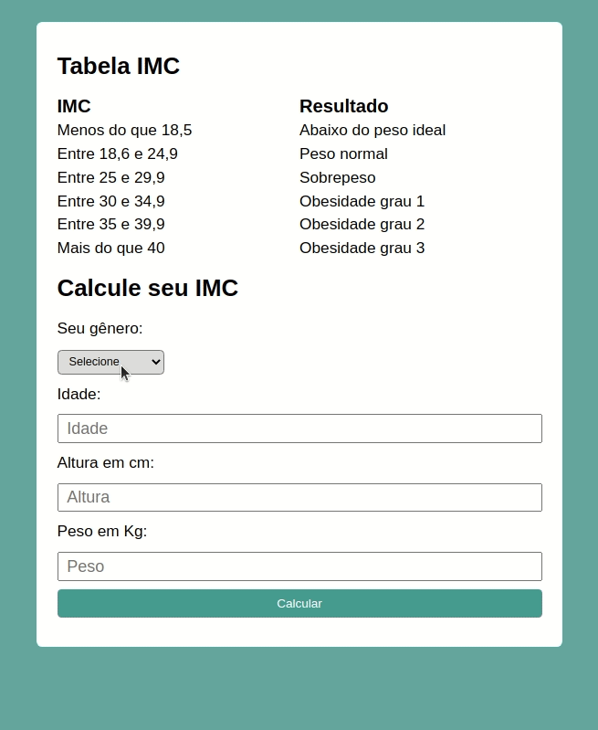

# :blue_book: Tabela IMC

## Acesse aqui https://andrematos28.github.io/tabela-imc/

## Sobre o projeto

---
Aplicação para exercitar o uso de HTML, CSS e JavaScript.

Conhecimentos praticados:
- Functions e Arrow functions
- Manipulação do DOM
- Estrutura condicional
- Alertas ao usuário

## O que faz a aplicação
---
* Solicita dados ao usuário, caso estes não forem preenchidos será mostrado um alert e focando no campo com o dado em falta (ou em formato inválido).
Após preenchido todos os campos, será calculado o IMC e mostrado na tela.
